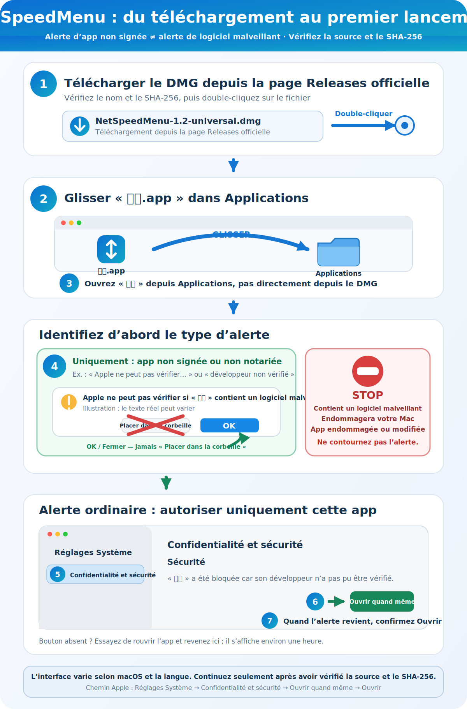
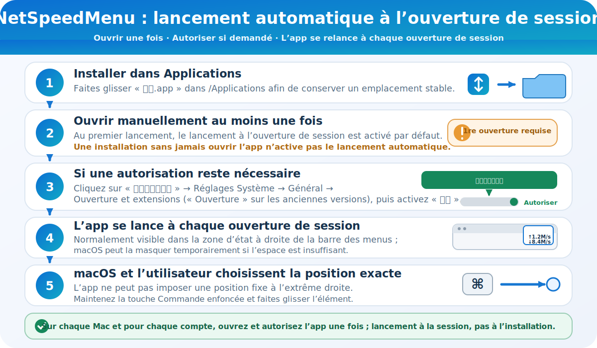

<p align="center">
  
</p>

# Guide d’utilisation de NetSpeedMenu 1.4

[简体中文](README.zh-CN.md) · [English](README.en.md) · [日本語](README.ja.md) · [Accueil](../README.md)

## Présentation

NetSpeedMenu (« 网速 ») est un petit utilitaire macOS qui affiche le débit réseau dans la barre des menus. `↑` indique le débit montant et `↓` le débit descendant. La zone occupée fait exactement 50 points et l’application n’apparaît pas dans le Dock.

La fenêtre de réglages contient :

- l’option de lancement silencieux à l’ouverture de session ;
- l’état actuel de l’élément d’ouverture ;
- un bouton ouvrant directement Réglages Système lorsqu’une autorisation est requise ;
- la description, la version et l’auteur ;
- le bouton « 退出网速 » (« Quitter NetSpeedMenu »).

L’application fonctionne sous macOS 13 ou version ultérieure, sur Mac Intel et Apple Silicon.

<p align="center">
  
</p>

## Télécharger et vérifier

Téléchargez `NetSpeedMenu-1.4-universal.dmg` depuis la page [Releases](../../../releases/latest) de ce dépôt. Le DMG est la méthode recommandée.

Vérifiez le fichier dans Terminal :

```bash
shasum -a 256 ~/Downloads/NetSpeedMenu-1.4-universal.dmg
```

SHA-256 attendu :

```text
8ba934190c84213a2a53f502301f3e1f0110bd1c9e46548d23d57ced5d95d7da
```

## Installation

Suivez d’abord les flèches du guide visuel. Le chemin vert s’applique uniquement aux alertes ordinaires d’app non signée ou non notariée ; arrêtez-vous si l’un des avertissements du cadre STOP rouge apparaît.

<p align="center">
  
</p>

1. Double-cliquez sur `NetSpeedMenu-1.4-universal.dmg`.
2. Faites glisser `网速.app` vers le dossier Applications affiché à côté.
3. Ouvrez le dossier Applications et trouvez `网速`.
4. Suivez les instructions de premier lancement ci-dessous.

Le PKG est également disponible. Faites un clic avec la touche Contrôle sur `NetSpeedMenu-1.4-universal.pkg`, choisissez **Ouvrir**, puis suivez l’installateur. Un mot de passe administrateur peut être demandé.

## Pourquoi macOS affiche un avertissement

L’application elle-même utilise une signature ad hoc créée sur le Mac du développeur, tandis que le programme d’installation PKG n’est pas signé. **Aucun des deux n’utilise de signature Apple Developer ID et cette version n’est pas notariée par Apple.** Gatekeeper ne peut donc ni vérifier l’identité du développeur ni confirmer qu’Apple a contrôlé cette compilation. Les messages suivants peuvent apparaître :

- « Impossible de vérifier le développeur » ;
- « Apple ne peut pas vérifier l’absence de logiciels malveillants » ;
- une proposition de placement dans la corbeille.

Ces messages ne prouvent pas à eux seuls qu’un logiciel malveillant a été détecté, mais ils ne doivent pas être ignorés. Vérifiez d’abord la source et le SHA-256.

## Premier lancement : méthode recommandée

1. Double-cliquez une première fois sur `网速.app` afin que macOS enregistre le blocage.
2. Si « Placer dans la corbeille » est proposé, choisissez **OK** ou fermez la fenêtre. Ne cliquez pas sur « Placer dans la corbeille ».
3. Ouvrez **Réglages Système → Confidentialité et sécurité**.
4. Descendez jusqu’à Sécurité, trouvez `网速`, puis cliquez sur **Ouvrir quand même**.
5. Confirmez **Ouvrir** et saisissez votre mot de passe si nécessaire.

Apple indique que le bouton Ouvrir quand même est normalement disponible pendant environ une heure après la tentative bloquée. L’application sera ensuite enregistrée comme exception. Consultez les [instructions officielles d’Apple](https://support.apple.com/guide/mac-help/mh40617/mac).

## Lancement automatique à l’ouverture de session

<p align="center">
  
</p>

1. Placez l’app dans Applications et ouvrez-la correctement au moins une fois. Une simple copie jamais ouverte ne peut pas enregistrer l’élément d’ouverture de l’utilisateur actuel.
2. Le lancement à l’ouverture de session est activé par défaut. Son état doit indiquer qu’il est activé.
3. Si une autorisation reste nécessaire, cliquez sur le bouton chinois **打开登录项设置** (« Ouvrir les réglages des éléments d’ouverture »), puis ouvrez **Réglages Système → Général → Ouverture et extensions** et activez **网速**. Les anciennes versions prises en charge peuvent afficher seulement **Ouverture**.
4. L’app se lance ensuite sans afficher de fenêtre à chaque ouverture de session, y compris après un redémarrage, et apparaît normalement dans la zone d’état à droite de la barre des menus. macOS peut la masquer temporairement si l’espace est insuffisant.
5. L’app ne peut rejoindre que la zone d’état de la barre des menus ; macOS gère les éléments système et l’ordre exact. Maintenez la touche Commande enfoncée et faites glisser l’indicateur de débit pour le repositionner. L’app ne peut pas imposer une position fixe à l’extrême droite.

Sur chaque nouveau Mac et pour chaque compte utilisateur d’un Mac partagé, l’app doit être ouverte une première fois et recevoir les autorisations requises. Copier l’app puis redémarrer sans jamais l’ouvrir n’enregistre pas d’élément d’ouverture.

## En cas d’avertissement plus grave

Si macOS indique explicitement que l’application « endommagera votre ordinateur », contient un logiciel malveillant, est endommagée ou a été modifiée :

- ne supprimez pas les attributs de quarantaine avec Terminal ;
- ne désactivez pas Gatekeeper globalement ;
- supprimez le fichier et téléchargez-le à nouveau depuis les Releases officielles ;
- vérifiez de nouveau le SHA-256 ;
- s’il diffère encore, n’exécutez pas l’application et compilez-la depuis les sources.

Apple explique ces avertissements dans [Ouvrir des apps en toute sécurité sur votre Mac](https://support.apple.com/102445).

## Utilisation

- `↑` : débit montant actuel
- `↓` : débit descendant actuel
- ouverture depuis Finder ou Applications : affiche les réglages
- lancement à l’ouverture de session : fonctionnement silencieux dans la barre des menus
- fermeture de la fenêtre : l’application continue de fonctionner
- 退出网速 (Quitter NetSpeedMenu) : arrête complètement l’application

## Confidentialité

L’application lit uniquement les compteurs cumulés d’octets des interfaces réseau fournis par macOS. Elle ne téléverse aucun fichier, n’envoie aucune télémétrie, ne contient aucune publicité et ne conserve pas le contenu du trafic réseau.

## Désinstallation

1. Désactivez le lancement à l’ouverture de session dans les réglages.
2. Cliquez sur 退出网速 (Quitter NetSpeedMenu).
3. Placez `/Applications/网速.app` dans la Corbeille.

Version : 1.4

Auteur : Guo Peng (郭鹏)
