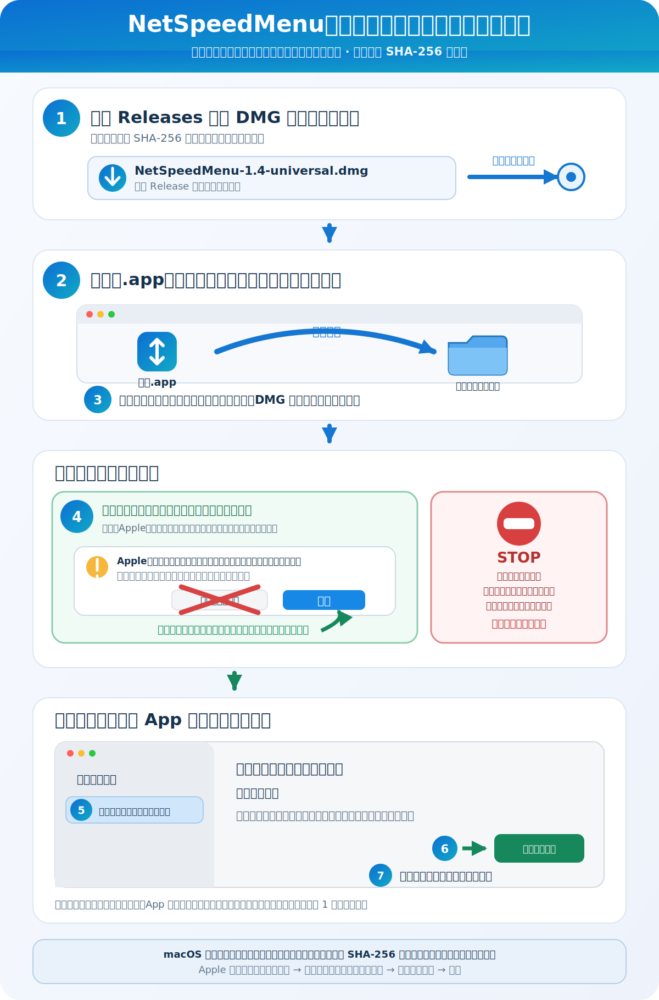
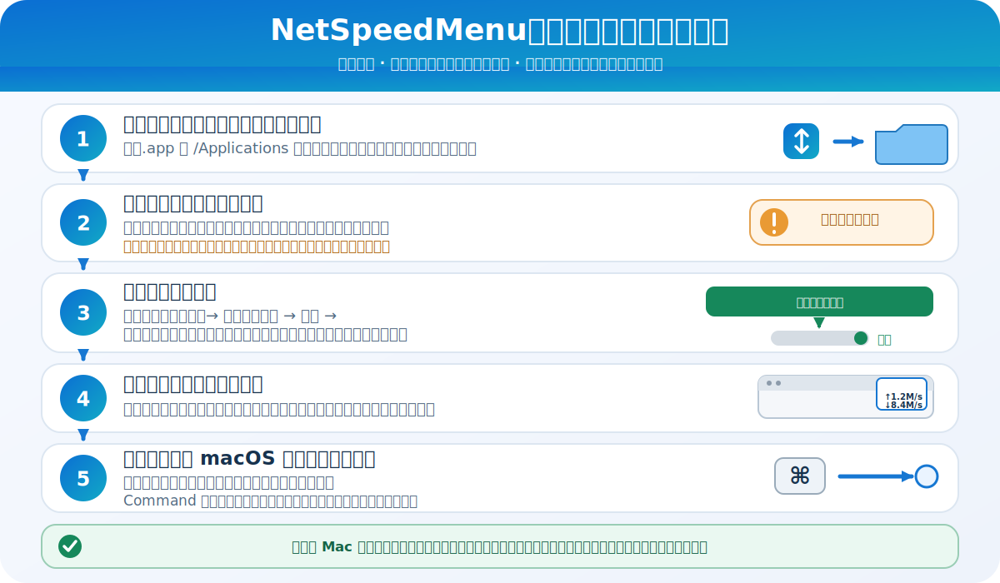

<p align="center">
  
</p>

# NetSpeedMenu 1.4 取扱説明書

[简体中文](README.zh-CN.md) · [English](README.en.md) · [Français](README.fr.md) · [ホーム](../README.md)

## 概要

NetSpeedMenu（网速）は、macOS のメニューバーに通信速度を表示する軽量アプリです。上段の `↑` はアップロード速度、下段の `↓` はダウンロード速度を示します。表示領域は 50 ポイント固定で、Dock には表示されません。

設定画面には次の項目があります。

- ログイン時にバックグラウンドで起動するスイッチ
- ログイン項目の現在の状態
- 承認が必要な場合にシステム設定を直接開くボタン
- アプリの説明、バージョン、作者
- 「退出网速」（NetSpeedMenu を終了）ボタン

macOS 13 以降の Intel Mac と Apple Silicon Mac に対応しています。

<p align="center">
  
</p>

## ダウンロードと確認

このリポジトリの [Releases](../../../releases/latest) ページから `NetSpeedMenu-1.4-universal.dmg` をダウンロードしてください。DMG 版を推奨します。

ターミナルで SHA-256 を確認します。

```bash
shasum -a 256 ~/Downloads/NetSpeedMenu-1.4-universal.dmg
```

正しい値：

```text
8ba934190c84213a2a53f502301f3e1f0110bd1c9e46548d23d57ced5d95d7da
```

## インストール

まず図の矢印に従ってください。緑の手順は通常の未署名／未公証アプリの警告にだけ使います。赤い STOP 欄に該当する警告が表示された場合は中止してください。

<p align="center">
  
</p>

1. `NetSpeedMenu-1.4-universal.dmg` をダブルクリックします。
2. `网速.app` を隣の Applications フォルダへドラッグします。
3. 「アプリケーション」フォルダで `网速` を探します。
4. 下記の初回起動手順に従ってください。

PKG 版も利用できます。`NetSpeedMenu-1.4-universal.pkg` を Control キーを押しながらクリックし、「開く」を選択してインストーラの指示に従います。管理者パスワードが必要になる場合があります。

## macOS が警告を表示する理由

アプリ本体は開発者の Mac で作成したアドホック署名を使用していますが、PKG インストーラ自体は未署名です。**いずれも Apple Developer ID の署名を使用しておらず、このリリースは Apple の公証も受けていません。** そのため、次の警告が表示される場合があります。

- 「開発元を確認できません」
- 「Apple は悪意のあるソフトウェアかどうかを確認できません」
- ゴミ箱へ移動するよう求めるダイアログ

これらは、それだけでマルウェアが検出されたことを意味しません。ただし、警告を無条件に無視してはいけません。必ず配布元と SHA-256 を確認してください。

## 初回起動：推奨手順

1. `网速.app` を一度ダブルクリックして、macOS にブロックを記録させます。
2. 「ゴミ箱に入れる」が表示された場合は「完了」を選ぶか、ダイアログを閉じます。「ゴミ箱に入れる」は選ばないでください。
3. 「システム設定」→「プライバシーとセキュリティ」を開きます。
4. 「セキュリティ」までスクロールし、ブロックされた `网速` の「このまま開く」をクリックします。
5. もう一度「開く」を確認し、必要に応じてログインパスワードを入力します。

Apple によると、「このまま開く」はブロックされた起動から約 1 時間表示されます。承認後、このアプリは例外として保存されます。[Apple の公式手順](https://support.apple.com/guide/mac-help/mh40617/mac)も参照してください。

## ログイン時に自動起動する

<p align="center">
  
</p>

1. アプリケーションフォルダへ移動し、少なくとも一度は正常に開いてください。コピーしただけで一度も開かなければ、現在のユーザーのログイン項目には登録できません。
2. ログイン時の自動起動は初期状態でオンです。状態が「有効」になっていることを確認します。
3. 承認が必要な場合は、中国語の **打开登录项设置**（「ログイン項目の設定を開く」）ボタンをクリックし、「システム設定 → 一般 → ログイン項目と機能拡張」で **网速** をオンにします。以前の macOS では「ログイン項目」と表示される場合があります。
4. 以後はログインのたびに、再起動後もウインドウを表示せずに起動し、通常はメニューバー右側のステータス領域に表示されます。空き領域が少ない場合、macOS が一時的に隠すことがあります。
5. アプリはメニューバーのステータス領域にのみ表示でき、システム項目と正確な順序は macOS が管理します。Command キーを押したまま速度表示をドラッグして位置を調整できますが、常に一番右へ固定することはできません。

新しい Mac ごと、また共有 Mac のユーザーアカウントごとに、一度正常に開いて必要な承認を行う必要があります。一度も開かずにコピーして再起動しただけでは、ログイン項目に登録されません。

## より重大な警告の場合

「コンピュータに損害を与えます」「マルウェアが含まれています」「破損しています」「変更されています」と明示された場合：

- ターミナルで隔離属性を削除しないでください。
- Gatekeeper 全体を無効にしないでください。
- ファイルを削除し、公式 Releases から再ダウンロードしてください。
- SHA-256 を再確認してください。
- 一致しない場合は実行せず、ソースからビルドしてください。

警告の違いについては、Apple の [Mac でアプリを安全に開く](https://support.apple.com/102445) を参照してください。

## 使い方

- `↑`：現在のアップロード速度
- `↓`：現在のダウンロード速度
- Finder またはアプリケーションから開く：設定画面を表示
- ログイン時の起動：メニューバーで静かに実行
- 設定画面を閉じる：アプリは継続して実行
- 「退出网速」（NetSpeedMenu を終了）：アプリを完全に終了

## プライバシー

macOS が提供するネットワークインターフェイスの累積バイト数だけを読み取ります。ファイルのアップロード、テレメトリ、広告、通信内容の保存は行いません。

## アンインストール

1. 設定画面でログイン時の自動起動をオフにします。
2. 「退出网速」（NetSpeedMenu を終了）をクリックします。
3. `/Applications/网速.app` をゴミ箱へ移動します。

バージョン：1.4

作者：郭鹏（Guo Peng）
