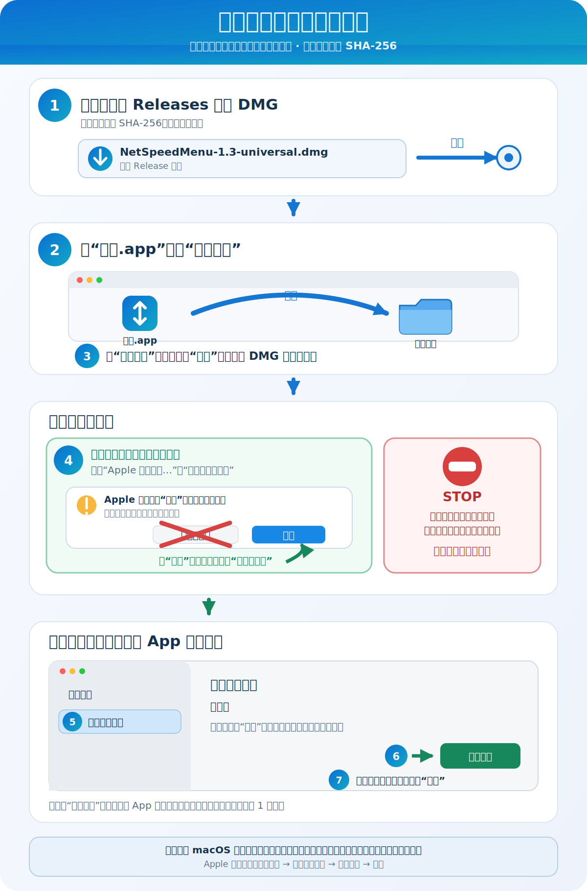
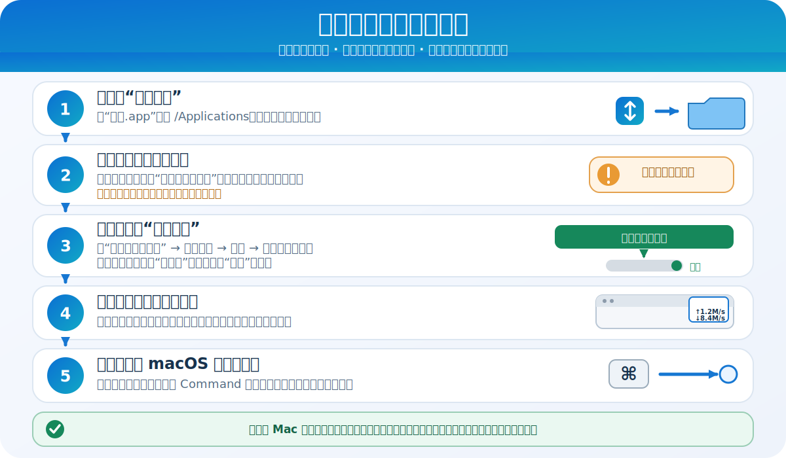

<p align="center">
  
</p>

# 网速 1.4 使用说明书

[English](README.en.md) · [日本語](README.ja.md) · [Français](README.fr.md) · [返回首页](../README.md)

## 软件介绍

“网速”是一款简洁的 macOS 菜单栏工具。菜单栏上方的 `↑` 显示实时上传速度，下方的 `↓` 显示实时下载速度。显示区域固定为 50 点宽，不占用 Dock，也不会弹出多余通知。

设置窗口提供：

- 登录后自动静默启动开关
- 当前登录项状态
- 登录项需要批准时的系统设置直达按钮
- 软件说明、版本和作者信息
- “退出网速”按钮

支持 macOS 13 及以上、Intel 与 Apple Silicon（M 系列）Mac。

<p align="center">
  
</p>

## 下载与校验

从本仓库的 [Releases](../../../releases/latest) 页面下载 `NetSpeedMenu-1.4-universal.dmg`。DMG 是推荐安装方式。

打开“终端”，校验下载文件：

```bash
shasum -a 256 ~/Downloads/NetSpeedMenu-1.4-universal.dmg
```

正确结果：

```text
8ba934190c84213a2a53f502301f3e1f0110bd1c9e46548d23d57ced5d95d7da
```

## 安装

先按图中的箭头操作。绿色路线只适用于普通的未签名／未公证警告；红色 STOP 提示出现时必须停止。

<p align="center">
  
</p>

1. 双击 `NetSpeedMenu-1.4-universal.dmg`。
2. 将“网速.app”拖入旁边的“Applications”文件夹。
3. 打开“应用程序”文件夹，找到“网速”。
4. 第一次启动请按照下面的“首次打开”步骤操作。

也可以使用 PKG：右键或按住 Control 点击 `NetSpeedMenu-1.4-universal.pkg`，选择“打开”，然后按照系统安装器提示操作。安装器可能要求管理员密码。

## 为什么 macOS 会发出警告

App 本体使用开发电脑上的 ad-hoc（临时）签名，PKG 安装器本身未签名。两者都未使用 Apple Developer ID，此发布版本也没有经过 Apple 公证。macOS Gatekeeper 无法确认作者身份，也无法确认 Apple 是否检查过这个构建，因此可能出现：

- “无法验证开发者”；
- “Apple 无法检查是否包含恶意软件”；
- 带有“移到废纸篓”的提示。

这类提示不等同于系统已经发现恶意软件，但也不能被忽略。请先确认下载来源和 SHA-256。

## 首次打开：推荐方法

1. 先正常双击“网速.app”一次，让 macOS 记录拦截原因。
2. 如果看到“移到废纸篓”，请选择“完成”或关闭提示，**不要点击“移到废纸篓”**。
3. 打开“系统设置”→“隐私与安全性”。
4. 向下滚动到“安全性”，找到刚刚被阻止的“网速”，点击“仍要打开”。
5. 再次确认“打开”，必要时输入登录密码。

Apple 表示，“仍要打开”按钮通常只在尝试打开后的大约一小时内出现。成功后，macOS 会把此 App 保存为安全设置中的例外。请参阅 [Apple 官方操作说明](https://support.apple.com/guide/mac-help/mh40617/mac)。

你也可以按住 Control 点击“网速.app”，选择“打开”；如果该方式仍被阻止，请使用上面的“隐私与安全性”方法。

## 登录后自动启动

<p align="center">
  
</p>

1. 将 App 放入“应用程序”并至少成功打开一次。仅仅复制文件、从未打开，无法为当前用户注册登录项。
2. “登录后自动静默启动”默认开启。状态应显示“已启用”。
3. 如果显示“还差一步”，点击“打开登录项设置”，在“系统设置 → 通用 → 登录项与扩展”中允许“网速”；较早的 macOS 版本可能只显示“登录项”。
4. 以后每次登录时（包括重启后的登录）都会静默启动，并通常显示在菜单栏右侧状态区域。菜单栏空间不足或项目过多时，macOS 可能暂时隐藏它。
5. App 只能进入菜单栏状态区域；系统项目和精确顺序由 macOS 管理。按住 Command 键并拖移网速显示，可以把它放到希望的位置，但 App 不能强制始终固定在最右侧。

每台新 Mac，以及同一台 Mac 上的每个用户账户，都需要分别成功打开一次并完成系统要求的批准。只复制 App、从未打开就直接重启，不会注册登录项。

## 看到严重警告时

如果提示明确写着“会损坏你的电脑”“包含恶意软件”，或者系统说 App 已损坏、已被修改：

- 不要使用终端命令删除隔离属性；
- 不要关闭整个系统的 Gatekeeper；
- 删除该文件并从官方 Releases 重新下载；
- 重新核对 SHA-256；
- 仍不一致时不要运行，可选择从源码自行构建。

Apple 对不同警告含义的说明见[安全地打开 Mac App](https://support.apple.com/102445)。

## 使用

- `↑`：当前上传速度
- `↓`：当前下载速度
- 手动从 Finder 或“应用程序”打开 App：显示设置窗口
- 登录项启动：重新登录或重启后仅在菜单栏静默运行
- 关闭设置窗口：App 继续运行
- 点击“退出网速”：完全结束 App

## 隐私

软件只读取 macOS 提供的网络接口累计字节数来计算速度。它不会上传文件、不会发送遥测、没有广告，也不会保存网络内容。

## 卸载

1. 打开“网速设置”，关闭“登录后自动静默启动”。
2. 点击“退出网速”。
3. 将 `/Applications/网速.app` 移到废纸篓。

版本：1.4

作者：郭鹏
